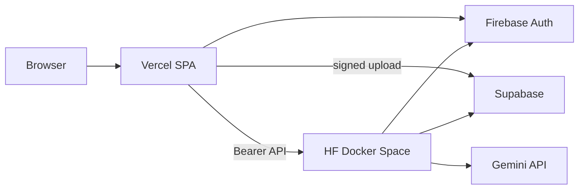

# Deploy: Hugging Face backend + Vercel frontend

> **Use Render instead for a free Docker backend:** [RENDER_VERCEL.md](RENDER_VERCEL.md)

Alternative / legacy path. **No GCP hosting** (no Cloud Run, Firebase Hosting, or Vertex).

| Component | Platform |
|-----------|----------|
| React app | [Vercel](https://vercel.com) (`frontend/`) |
| FastAPI + OCR/Gemini/TTS pipeline | [Hugging Face Spaces](https://huggingface.co/spaces) Docker (`backend/`) |
| Login | Firebase Auth (console config only) |
| Database + PDF/audio storage | Supabase |

## Architecture



## Hugging Face requirement (important)

As of 2026, **Docker Spaces on `cpu-basic` require a Hugging Face [Pro](https://huggingface.co/pro) subscription** ($9/mo). Static Spaces remain free but cannot run this FastAPI + PaddleOCR stack.

If you stay on free HF only, you must either subscribe to Pro for Docker Spaces or choose a different backend host (not covered here).

---

## 1. Prerequisites

- Firebase project with Auth enabled (Google + email/password)
- Supabase project with migrations applied (`backend/db/migrations/`)
- [Gemini API key](https://aistudio.google.com/apikey) (`GEMINI_API_KEY`)
- Firebase **service account** JSON (Project settings → Service accounts → Generate new private key)
- GitHub repo connected to HF and Vercel (recommended)

---

## 2. Hugging Face Space (backend)

### Create the Space

1. Go to [huggingface.co/new-space](https://huggingface.co/new-space)
2. **SDK:** Docker
3. **Hardware:** CPU basic (requires HF Pro for Docker)
4. Connect this repository with **Root directory** = `backend`

Or use the script (after Pro is active):

```powershell
.\scripts\deploy-hf-space.ps1 -SpaceId "Gol-D0-Roger/manhwa-ai-api"
```

The Space uses [`backend/Dockerfile`](backend/Dockerfile) (same as [`backend/Dockerfile.space`](backend/Dockerfile.space)): FastAPI on `$PORT` (7860) with `PIPELINE_EXECUTION_MODE=local`.

### Space secrets

In **Settings → Variables and secrets** (secrets, not public variables):

| Name | Value |
|------|--------|
| `SUPABASE_URL` | Supabase project URL |
| `SUPABASE_SERVICE_ROLE_KEY` | Service role key (never expose to frontend) |
| `FIREBASE_PROJECT_ID` | Firebase / GCP project id |
| `FIREBASE_SERVICE_ACCOUNT_JSON` | **Single-line minified** service account JSON |
| `GEMINI_API_KEY` | Google AI Studio key |
| `CORS_ALLOWED_ORIGINS` | `https://your-app.vercel.app` (comma-separated) |
| `PIPELINE_EXECUTION_MODE` | `local` |

Optional tuning: `MAX_PDF_BYTES`, `GEMINI_MODEL`, quota vars (see [`backend/.env.example`](../backend/.env.example)).

### Wake / sleep behavior

Free and basic CPU Spaces **sleep** when idle. Open the Space URL or call `GET /health` before starting a long upload. Pipelines run in-process via FastAPI `BackgroundTasks`; a Space restart can interrupt a running job.

### Verify backend

```powershell
.\scripts\verify-deploy.ps1 -ApiBaseUrl "https://Gol-D0-Roger-manhwa-ai-api.hf.space"
```

(`GET /health` should return JSON with status ok.)

---

## 3. Vercel (frontend)

### Import project

1. [vercel.com/new](https://vercel.com/new) → import Git repo
2. **Root Directory:** `frontend`
3. **Build command:** `npm run build`
4. **Output directory:** `dist`

[`frontend/vercel.json`](../frontend/vercel.json) already configures SPA rewrites.

### Environment variables

Set for **Production** (and Preview if you test PRs):

| Variable | Example |
|----------|---------|
| `VITE_API_BASE_URL` | `https://<user>-<space>.hf.space` |
| `VITE_FIREBASE_API_KEY` | Firebase web API key |
| `VITE_FIREBASE_AUTH_DOMAIN` | `project.firebaseapp.com` |
| `VITE_FIREBASE_PROJECT_ID` | Project id |
| `VITE_FIREBASE_STORAGE_BUCKET` | `project.appspot.com` |
| `VITE_FIREBASE_MESSAGING_SENDER_ID` | From Firebase console |
| `VITE_FIREBASE_APP_ID` | Web app id |
| `VITE_SUPABASE_URL` | Supabase URL |
| `VITE_SUPABASE_ANON_KEY` | Anon key (public) |
| `VITE_MAX_PDF_MB` | `50` (optional) |

Redeploy after changing any `VITE_*` variable.

### CLI deploy (optional)

```powershell
.\scripts\deploy-vercel.ps1
```

Requires `npx vercel` login on first run.

---

## 4. Firebase console (CORS / auth domains)

1. **Authentication → Settings → Authorized domains**
   - Add `your-app.vercel.app`
   - For preview deploys, add `your-app-git-branch-team.vercel.app` or use a stable production domain only

2. **Google sign-in provider**
   - In Google Cloud Console → OAuth client used by Firebase, add **Authorized JavaScript origins**:
     - `https://your-app.vercel.app`

No redirect URI changes are required for popup-based Google sign-in.

---

## 5. Supabase console (storage CORS)

If browser uploads to signed URLs fail with CORS errors:

1. Supabase Dashboard → **Storage** → configuration / CORS (or project API settings)
2. Allow origin: `https://your-app.vercel.app`
3. Allow methods: `GET`, `POST`, `PUT`, `HEAD`

Buckets `pdfs`, `pages`, and `audio` remain private; the anon key is only used for client-side signed uploads.

---

## 6. Backend CORS

Set on the Space secret `CORS_ALLOWED_ORIGINS` to match **exact** Vercel origins (scheme + host, no trailing slash). Never use `*` in production.

---

## 7. End-to-end test checklist

| Step | Expected |
|------|----------|
| Wake Space | `GET /health` succeeds |
| Login on Vercel | Firebase session; API calls include Bearer token |
| Upload PDF | Under 50 MB; job reaches `PROCESSING` |
| Wait | Job reaches `TTS_COMPLETED` (may take many minutes on CPU) |
| Assets | `GET /jobs/{id}/assets` returns page/audio URLs |
| Context preview | Typing manhwa name returns blurb on Upload page |

---

## 8. Troubleshooting

| Symptom | Fix |
|---------|-----|
| `402` creating Docker Space | HF Pro required for Docker Spaces |
| `401` on API | Check Firebase token; `FIREBASE_SERVICE_ACCOUNT_JSON` on Space |
| CORS error | Add Vercel URL to `CORS_ALLOWED_ORIGINS` |
| `GEMINI_API_KEY` errors | Key valid in AI Studio; model name matches `GEMINI_MODEL` |
| Job stuck / lost | Space slept; wake Space and retry; check Space logs |
| `413` on upload-url | PDF over `MAX_PDF_BYTES` |
| Build timeout on HF | Large PaddleOCR image; retry build or use paid hardware |

---

## Legacy GCP deployment

Cloud Run + Firebase Hosting + Vertex are **deprecated** for this project. See [GCP_DEPLOYMENT.md](GCP_DEPLOYMENT.md) only if you maintain an old stack.
