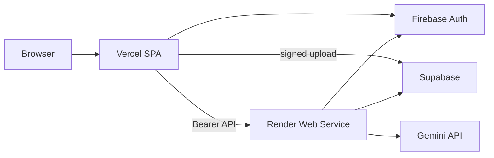

# Deploy: Render backend + Vercel frontend

Primary production path. **No GCP hosting** (no Cloud Run, Firebase Hosting, or Vertex).

| Component | Platform |
|-----------|----------|
| React app | [Vercel](https://vercel.com) (`frontend/`) |
| FastAPI + OCR/Gemini/TTS pipeline | [Render](https://render.com) Web Service (Docker, `backend/`) |
| Login | Firebase Auth (console only) |
| Database + PDF/audio storage | Supabase |

## Architecture



## Free tier notes (Render)

- **Free web services** spin down after ~15 minutes of no traffic; the first request after sleep is slow (cold start).
- **512 MB RAM** on the free plan is tight for PaddleOCR + OpenCV. If the service crashes during processing, upgrade to **Starter** ($7/mo) or higher in the Render dashboard.
- Docker **first build** can take 20–40 minutes (PaddleOCR image). Later deploys are faster if the layer cache is warm.
- Pipelines run in-process (`PIPELINE_EXECUTION_MODE=local`); a deploy or restart can interrupt a running job.

---

## 1. Prerequisites

- Firebase project with Auth enabled
- Supabase project with migrations applied (`backend/db/migrations/`)
- [Gemini API key](https://aistudio.google.com/apikey)
- Firebase service account JSON (minified to one line for env vars)
- GitHub repo pushed (Render deploys from Git)

---

## 2. Render (backend)

### Option A — Blueprint (recommended)

1. Push this repo to GitHub.
2. Open [Render Dashboard → Blueprints](https://dashboard.render.com/blueprints).
3. **New Blueprint Instance** → connect the repo.
4. Render reads [`render.yaml`](../render.yaml) and creates the `manhwa-api` web service.
5. When prompted, set **secret** environment variables (see table below).
6. Wait for the Docker build and deploy; note the URL: `https://manhwa-api.onrender.com` (or your chosen service name).

### Option B — Manual web service

1. **New → Web Service** → connect repo.
2. **Root Directory:** leave empty (monorepo).
3. **Environment:** Docker.
4. **Dockerfile path:** `backend/Dockerfile`
5. **Docker build context:** `backend`
6. **Health check path:** `/health`
7. Add environment variables from the table below.

### Required environment variables

| Variable | Notes |
|----------|--------|
| `SUPABASE_URL` | Supabase project URL |
| `SUPABASE_SERVICE_ROLE_KEY` | Server-only |
| `FIREBASE_PROJECT_ID` | Firebase project id |
| `FIREBASE_SERVICE_ACCOUNT_JSON` | Single-line minified JSON |
| `GEMINI_API_KEY` | Google AI Studio |
| `CORS_ALLOWED_ORIGINS` | `https://your-app.vercel.app` (comma-separated, no trailing slashes) |
| `PIPELINE_EXECUTION_MODE` | `local` (set in `render.yaml` for Blueprint) |

Optional: `MAX_PDF_BYTES`, `GEMINI_MODEL`, quota vars — see [`backend/.env.example`](../backend/.env.example).

Render sets **`PORT`** automatically; the Dockerfile binds `uvicorn` to `${PORT}`.

### Verify backend

```powershell
.\scripts\verify-deploy.ps1 -ApiBaseUrl "https://manhwa-api.onrender.com"
```

---

## 3. Vercel (frontend)

1. Import repo at [vercel.com/new](https://vercel.com/new).
2. **Root Directory:** `frontend`
3. **Build:** `npm run build` · **Output:** `dist`

Environment variables (Production):

| Variable | Value |
|----------|--------|
| `VITE_API_BASE_URL` | `https://manhwa-api.onrender.com` (your Render URL) |
| `VITE_FIREBASE_*` | From Firebase console |
| `VITE_SUPABASE_URL` | Supabase URL |
| `VITE_SUPABASE_ANON_KEY` | Anon key |

Redeploy after changing any `VITE_*` value.

```powershell
.\scripts\deploy-vercel.ps1
```

---

## 4. Firebase console

- **Authentication → Authorized domains:** add `your-app.vercel.app`
- **Google sign-in:** add Vercel origin to OAuth **JavaScript origins**

---

## 5. Supabase console

If signed PDF uploads fail with CORS, allow your Vercel origin on Storage (GET, POST, PUT, HEAD).

---

## 6. End-to-end checklist

| Step | Expected |
|------|----------|
| Wake API | `GET /health` on Render URL returns `{"status":"ok"}` |
| Login on Vercel | Firebase session; API calls include Bearer token |
| Upload PDF | Job moves to `PROCESSING` |
| Pipeline | Reaches `TTS_COMPLETED` (may take many minutes on free CPU) |
| Assets | Signed URLs for pages/audio |

```powershell
.\scripts\e2e-verify.ps1 -ApiBaseUrl "https://manhwa-api.onrender.com"
```

---

## 7. Troubleshooting

| Symptom | Fix |
|---------|-----|
| Build fails / timeout | Retry deploy; check Render build logs |
| OOM / worker killed | Upgrade Render plan; reduce PDF size |
| `502` after idle | Free tier slept; hit `/health` then retry |
| CORS | Match exact Vercel URL in `CORS_ALLOWED_ORIGINS` |
| `401` | Check `FIREBASE_SERVICE_ACCOUNT_JSON` on Render |

---

## Alternatives

- [HF_SPACES_VERCEL.md](HF_SPACES_VERCEL.md) — Hugging Face Docker (requires HF Pro for Docker Spaces).
- [GCP_DEPLOYMENT.md](GCP_DEPLOYMENT.md) — legacy Cloud Run stack.
